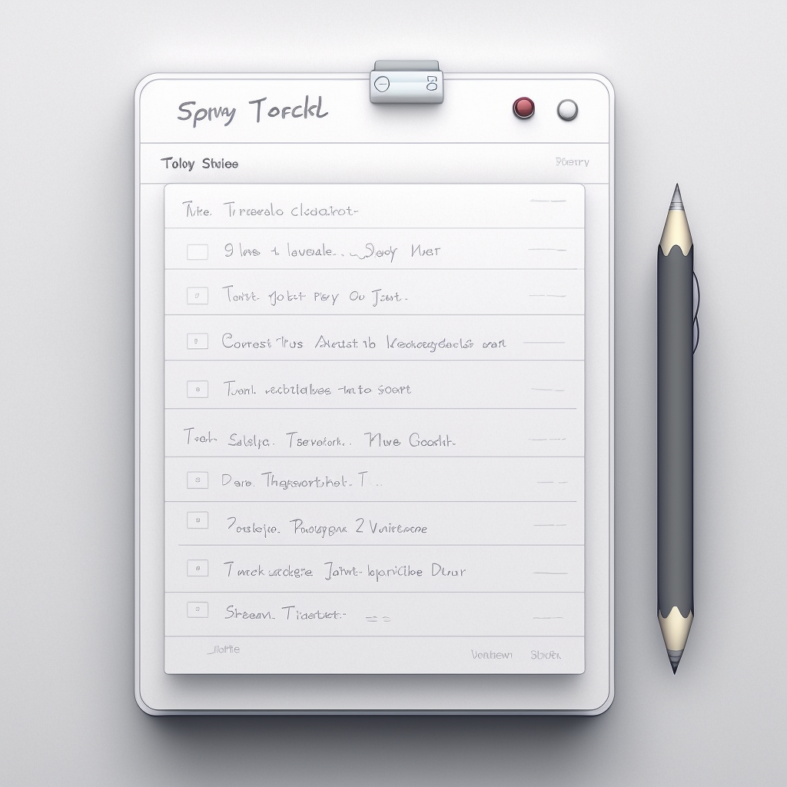

### <h1 align="center" style="color:blue;" id="heading">TODO APP for QA</h1>

<!-- PROJECT LOGO -->
 

  

# QA TODO APP

This repository contains a QA TODO app that allows users to track a tasks. Built with HTML, CSS, and JavaScript and browser storage to save data. It includes a "before" version for initial QA purposes and an "after" version that demonstrates the changes made after a QA task is completed. The primary purpose of this app is to create an automation test framework that can detect and fix issues within the app.

## Features
- Add and remove QA tasks
- Mark tasks as complete
- Taks has a time stamp 
- Data is saved in browser storage for persistence

## Getting Started

You can use the app to make QA tasks as needed. To start with the app, clone this repository to your local machine and open the "before" version of the app in your preferred web browser. You can view the "after" version to see the changes made after QA tasks have been fixed. Create an automation test for all the test cases and resolve the issue on the "before" version.

## Prerequisites
This app requires a web browser to run and the latest versions of playwright.

## Contributing

If you want to contribute to this project, please fork this repository and submit a pull request with your changes. All contributions are welcome and appreciated!

## License
This project is licensed under the MIT License - see the [LICENSE](https://github.com/saboye/QA-TODO-APP/blob/main/LICENSE) file for details.
